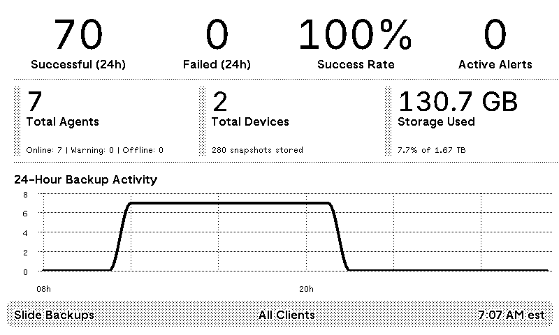

## TRMNL Slide Backup Dashboard

This directory provides two ways to show Slide backup data on TRMNL devices:

- JSON endpoint + Liquid template (recommended for TRMNL widgets)
- A server-rendered dashboard for quick previews or TRMNL web views



*Sample dashboard showing backup statistics, agent status, storage usage, and 24-hour activity chart*

### Files

- `index.php` – Server-rendered TRMNL-styled dashboard (accepts the same parameters as the JSON endpoint)
- `display.php` – Thin wrapper that includes `index.php` (kept for TRMNL compatibility)
- `json.php` – JSON API endpoint that returns dashboard data
- `liquid.html` – TRMNL Liquid template that renders the JSON shape
- `api.php` – Slide API helper class (dependency)
- `test-json-post.php` – Test script for the JSON POST functionality
- `test_url_examples.php` – Prints example URLs showing timezone usage
- `test_filter_summary.php` – CLI sanity check for client-filtered vs. all-client stats
- `docs/` – TRMNL framework reference and example components

---

### Integration options

#### Option A: TRMNL data source + Liquid template (recommended)

1. Set the data URL to `https://www.slide.recipes/trmnl/json.php`.
2. Provide parameters via GET or POST JSON (see below).
3. Upload `liquid.html` as the template. It expects the `data` object returned by `json.php`.

#### Option B: Direct web view (preview-only or TRMNL web URL)

- Use `https://www.slide.recipes/trmnl/index.php?api_key=YOUR_API_KEY&timezone=EST&client_filter=ClientName`.
- Accepts the same parameters as the JSON endpoint and renders a complete TRMNL-styled view with chart/alerts.

#### Option C: TRMNL Screenshot plugin

1. Navigate to **Plugins > Screenshot** in your TRMNL dashboard.
2. Enter the URL: `https://www.slide.recipes/trmnl/index.php?api_key=YOUR_API_KEY&timezone=EST&client_filter=ClientName`
   - Replace `YOUR_API_KEY` with your actual Slide API key
   - Adjust `timezone` and `client_filter` parameters as needed
3. The screenshot plugin will capture the rendered dashboard at 800x480 resolution.
4. Set your desired refresh interval (recommended: ≥ 60 seconds to avoid API rate limits).

**Screenshot plugin notes:**
- The dashboard is optimized for TRMNL's 800x480 display resolution
- All styling uses absolute URLs and should render correctly in the screenshot service
- No authentication headers are required since the API key is passed as a URL parameter

---

### Parameters

| Parameter | Source | Required | Description | Default |
|-----------|--------|----------|-------------|---------|
| `api_key` | GET or JSON POST | Yes | Your Slide API key | – |
| `client_filter` | GET or JSON POST | No | Case-insensitive partial match on client name | All clients |
| `timezone` | GET or JSON POST | No | One of `EST`, `CST`, `MST`, `PST` | `EST` |

Allowed timezone values map to: `EST → America/New_York`, `CST → America/Chicago`, `MST → America/Denver`, `PST → America/Los_Angeles`.

---

### Example requests

#### GET (JSON endpoint)

```bash
curl "https://www.slide.recipes/trmnl/json.php?api_key=YOUR_API_KEY&timezone=EST&client_filter=ClientName"
```

#### POST JSON (JSON endpoint)

```bash
curl -X POST https://www.slide.recipes/trmnl/json.php \
  -H "Content-Type: application/json" \
  -d '{"api_key":"YOUR_API_KEY","timezone":"EST","client_filter":"ClientName"}'
```

#### Direct web view (preview)

```text
https://www.slide.recipes/trmnl/index.php?api_key=YOUR_API_KEY&timezone=EST&client_filter=ClientName
```

#### TRMNL Screenshot plugin

```text
Plugin: Screenshot
URL: https://www.slide.recipes/trmnl/index.php?api_key=YOUR_API_KEY&timezone=EST&client_filter=ClientName
```

---

### Response format (json.php)

```json
{
  "status": "success",
  "message": "Data retrieved successfully",
  "data": {
    "successful_backups_24h": 42,
    "failed_backups_24h": 2,
    "success_rate": 95.5,
    "active_alerts": 0,
    "total_agents": 10,
    "agents_online": 8,
    "agents_warning": 1,
    "agents_offline": 1,
    "total_devices": 15,
    "total_snapshots": 1234,
    "storage_used": 1099511627776,
    "storage_used_formatted": "1 TB",
    "storage_total": 5497558138880,
    "storage_total_formatted": "5 TB",
    "storage_used_percent": 20,
    "hourly_backups": [{"hour":"YYYY-MM-DD HH:00","count":0}],
    "backup_trends": [{"date":"YYYY-MM-DD","successful":0,"failed":0}],
    "recent_alerts": [{
      "id": "...",
      "type": "agent_backup_failed",
      "created_at": "ISO-8601",
      "title": "Backup Failed",
      "message": "...",
      "device_name": "...",
      "agent_hostname": "...",
      "time_ago": "1 hour ago"
    }],
    "client_name": "All Clients",
    "timezone": "EST",
    "current_time": "3:45 PM",
    "last_updated": "2024-01-15T15:45:00-05:00",
    "has_alerts": false,
    "show_chart": true
  }
}
```

---

### TRMNL setup checklist

**Option A: Data source + Liquid template (recommended)**
- Data URL: `https://www.slide.recipes/trmnl/json.php`
- Template: upload `liquid.html`
- Refresh interval: as desired (recommend ≥ 60s)
- Parameters: set via GET on the URL or JSON POST

**Option C: Screenshot plugin**
- Plugin: Screenshot
- URL: `https://www.slide.recipes/trmnl/index.php?api_key=YOUR_API_KEY&timezone=EST&client_filter=ClientName`
- Refresh interval: ≥ 60 seconds (to avoid API rate limits)
- No additional headers required

---

### Testing

#### Browser

- Preview JSON POST helper: `https://www.slide.recipes/trmnl/test-json-post.php`
- Preview the full dashboard: `https://www.slide.recipes/trmnl/index.php?api_key=YOUR_API_KEY`

#### Command line

```bash
php test-json-post.php
php test_url_examples.php
php test_filter_summary.php
```

---

### Features

- **Real-time stats**: Successful/failed backups in the last 24 hours
- **System overview**: Agents by status, device count, snapshot total, storage usage
- **Alerts**: Shows newest unresolved alerts with context
- **Chart**: 24‑hour backup activity (shown when no active alerts)
- **Client filter**: Optional case-insensitive partial match on client name
- **Timezone support**: `EST`, `CST`, `MST`, `PST`

---

### Troubleshooting

- **No data returned**: Check API key validity/permissions
- **Client filter not working**: Ensure the client name exists (partial match is supported)
- **Wrong timezone**: Use one of `EST`, `CST`, `MST`, `PST`
- **JSON parse errors**: Verify POST body is valid JSON

### Error responses

```json
{
  "status": "error",
  "message": "Error description here",
  "data": null
}
```

Common messages include:
- "No API key provided" – Missing `api_key`
- "Invalid JSON in POST body" – Malformed JSON
- "API Error (401): Unauthorized" – Invalid API key
- "API Error (404): Client not found" – `client_filter` did not match any client

---

### Security notes

- Do not embed your API key in public templates or screenshots.
- Prefer POSTing JSON from TRMNL when possible to avoid overly long URLs.